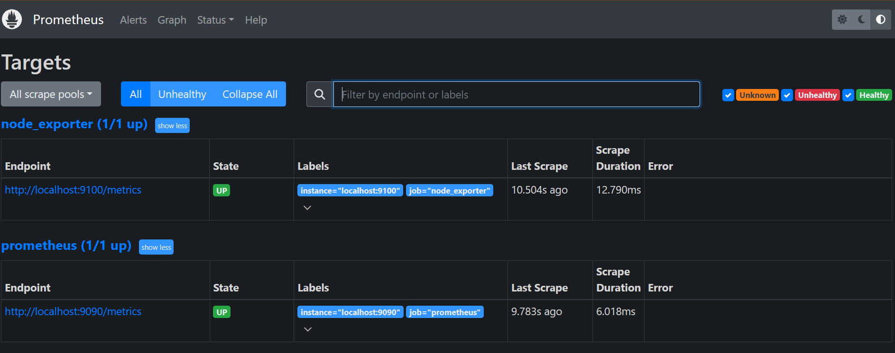
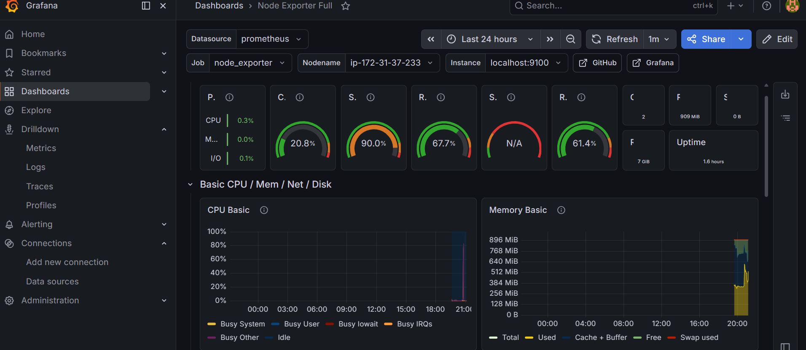

<div align="center">


<br/>


<br/>

> 🤖 *AI-assisted observability stack — monitor everything, miss nothing.*

</div>

---

## 🏗️ Architecture

```
╔══════════════════════════════════════════════╗
║           AWS EC2  (Ubuntu Server)           ║
║                                              ║
║   ┌──────────────────────────────────────┐   ║
║   │  📦  Node Exporter        :9100      │   ║
║   │  Collects all system metrics         │   ║
║   └──────────────┬───────────────────────┘   ║
║                  │  scrapes every 15s        ║
║                  ▼                           ║
║   ┌──────────────────────────────────────┐   ║
║   │  🔥  Prometheus           :9090      │   ║
║   │  Stores, queries, evaluates rules    │   ║
║   └──────────────┬───────────────────────┘   ║
║                  │  datasource               ║
║                  ▼                           ║
║   ┌──────────────────────────────────────┐   ║
║   │  📊  Grafana              :3000      │   ║
║   │  Dashboards + Alert Rules            │   ║
║   └──────────────────────────────────────┘   ║
╚══════════════════════════════════════════════╝
```

---

## ⚙️ Infrastructure Setup

### 🖥️ EC2 Instance

| Component | Value |
|:---|:---|
| ☁️ Cloud Provider | AWS |
| 🐧 OS | Ubuntu Server |
| 📈 Monitoring Stack | Prometheus + Grafana |
| 📡 Metrics Collector | Node Exporter |

### 🔐 Security Groups

| Port | Service | Status |
|:---:|:---|:---:|
| `22` | SSH | 🟢 |
| `80` | Nginx | 🟢 |
| `3000` | Grafana | 🟢 |
| `9090` | Prometheus | 🟢 |
| `9100` | Node Exporter | 🟢 |

---

## 📡 Node Exporter

> Installed as a **systemd service** — auto-starts on reboot, exposes metrics at `:9100`

```
📊 Metrics Exposed
├── 🖥️  CPU        → usage, idle%, system, user per core
├── 🧠  Memory     → total, used, free, buffers, cached
├── 💾  Disk       → IOPS, read/write throughput, capacity
└── 🌐  Network    → bytes in/out, packet errors, drops
```

```bash
# Live metrics endpoint
curl http://SERVER_IP:9100/metrics
```

---

## 🔥 Prometheus Setup

### Scrape Config

```yaml
# prometheus.yml
scrape_configs:
  - job_name: "prometheus"
    static_configs:
      - targets: ["localhost:9090"]

  - job_name: "node_exporter"
    static_configs:
      - targets: ["localhost:9100"]
```

### Target Health

```
✅  prometheus    → UP
✅  node_exporter → UP
```

---

## 📊 Grafana Setup

```
Dashboard : Node Exporter Full
ID        : 1860
Source    : grafana.com/grafana/dashboards/1860
```

| Panel | Metric |
|:---|:---|
| 🖥️ CPU Usage | Per-core utilization graph |
| 🧠 Memory | RAM consumption over time |
| 💾 Disk I/O | Read/Write IOPS |
| 🌐 Network Traffic | Bytes in & out |
| ⚡ System Load | 1m · 5m · 15m averages |
| ⏱️ Uptime | Instance health status |

---

## 🚨 Alerting

### Alert Rule — High CPU

```yaml
groups:
  - name: node_alerts
    rules:
      - alert: HighCPUUsage
        expr: >
          100 - (avg by(instance)
            (rate(node_cpu_seconds_total{mode="idle"}[1m])) * 100) > 10
        for: 10s
        labels:
          severity: warning
        annotations:
          summary: "High CPU usage on {{ $labels.instance }}"
```

### Alert Lifecycle

```
⏳ PENDING  ──────────────────────►  🔥 FIRING
  (threshold crossed)                 (sustained 10s)
```

```bash
# Generate CPU load to trigger alert
stress --cpu 2 --timeout 300
```

---

## 🛠️ Troubleshooting Log

<details>
<summary>🔴 Issue #1 — Node Exporter Download 404</summary>
<br>

**Error:** GitHub latest release URL returned `404 Not Found`

**Fix:** Pinned to a specific stable release tag + verified `amd64` architecture

</details>

<details>
<summary>🔴 Issue #2 — Prometheus YAML Parse Error</summary>
<br>

**Error:**
```
cannot unmarshal !!map into []string
```

**Fix:**
```bash
promtool check config prometheus.yml
# Corrected indentation + targets syntax
```

</details>

<details>
<summary>🔴 Issue #3 — Prometheus Service status=217/USER</summary>
<br>

**Error:** `Failed to determine credentials for user 'prometheus'`

**Fix:**
```bash
sudo useradd --no-create-home --shell /bin/false prometheus
sudo chown -R prometheus:prometheus /etc/prometheus
```

</details>

<details>
<summary>🔴 Issue #4 — SIGBUS Crash on Startup</summary>
<br>

**Error:** `unexpected fault address` / `SIGBUS`

**Fix:** Removed corrupted binary, re-downloaded stable release, verified checksum

</details>

<details>
<summary>🔴 Issue #5 — Disk Quota Exceeded</summary>
<br>

**Error:** `Disk quota exceeded` during install

**Fix:** Cleared `/tmp`, clean redeployment of all components

</details>

<details>
<summary>🔴 Issue #6 — Alert Stuck in Pending</summary>
<br>

**Problem:** Alert never transitioned to `FIRING`

**Fix:**
```bash
stress --cpu 2 --timeout 300
# Confirmed: PENDING → FIRING ✅
```

</details>

---

## 🎓 Skills Applied

```
🟦 Linux Administration    systemd, users, permissions, cron
🟧 AWS Infrastructure      EC2, Security Groups, cloud networking  
🟥 Prometheus              PromQL, scraping, alert rules
🟩 Grafana                 Datasources, dashboards, panels
🟪 Alerting                States, stress testing, validation
⬛ Troubleshooting         Root cause analysis, log investigation
```

---

## 🚀 Roadmap

- [ ] 📬 **Alertmanager** — Email & Slack notifications
- [ ] ☁️ **CloudWatch** — Native AWS metrics integration
- [ ] 🏗️ **Terraform** — Full IaC provisioning
- [ ] 🔁 **CI/CD** — Automated redeploy pipeline
- [ ] 🖥️ **Multi-Server** — Scale to multiple EC2 instances
- [ ] ☸️ **Kubernetes** — Prometheus Operator + kube-state-metrics

---

## 📸 Screenshots

| Prometheus Targets | Grafana Dashboard |
|:---:|:---:|
|  |  |

| Alert Pending | Alert Firing |
|:---:|:---:|
|  |  |

---

<div align="center">


**Made with ❤️ by Sapna Kumari**


</div>
